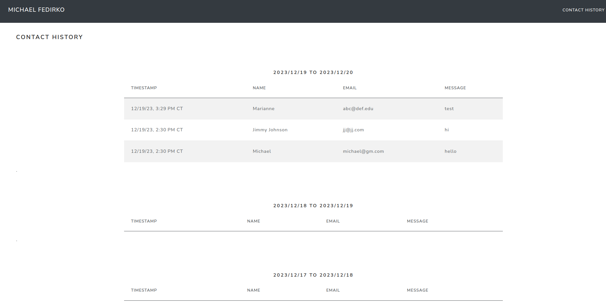

This is a full-stack developer portfolio and the source code for https://michaelfedirko.com.

## Main Features
- Single page with scroll navigation. Responsive website built using Bootstrap
- Contact Me form with validation and reCaptcha
- Learning section contains a list of lessons learned editable by admin in .md syntax
- Links to Resume, GitHub and LinkedIn
- Admin functionality
  - GitHub secured sign-in
  - View history of Contact Me requests
  - Create, update and delete items in Learning section using .md syntax

## Technologies Used
- [Kotlin 1.8.x](https://kotlinlang.org/) 
- [Spring Boot 3.x](https://spring.io/projects/spring-boot)
- [Thymeleaf](https://www.thymeleaf.org/) - server-side template engine with good Spring Boot compatibility
- [HTMX](https://htmx.org/) - modern website features without JavaScript
- [Bootstrap](https://getbootstrap.com/) - modern JS and CSS framework
- [Bootswatch](https://bootswatch.com/) - enhanced styles on top of default Bootstrap
- CI/CD using [Github Actions](./.github/workflows)
- Deployed in AWS
  - [Cloudformation](./aws/cloudformation/master.yaml) Infrastructure as Code 
  - [ECS Fargate](./aws/cloudformation/infrastructure/ecs-cluster.yaml) runs the [application service](./aws/cloudformation/services/server-backend/service.yaml)
  - ECR stores Docker images for the application
  - [ALB balances load](./aws/cloudformation/infrastructure/load-balancers.yaml) across ECS tasks
  - [DynamoDB tables](./aws/cloudformation/infrastructure/dynamodb.yaml) store Learning and Contact Me data
  - [VPC endpoints](./aws/cloudformation/infrastructure/vpc.yaml) allow traffic from private subnet going to S3/DynamoDB/ECR/CloudWatch to stay within AWS

## Local Development
#### Initial Setup
1. Install JDK 17 or higher (if using Intellij, you can [download a JDK within the IDE](https://www.jetbrains.com/guide/java/tips/download-jdk/))
2. Install Kotlin 1.8 or higher (if using Intellij, you can enable the [Kotlin plugin](https://plugins.jetbrains.com/plugin/6954-kotlin))
3. Install [Docker and Docker Desktop](https://docs.docker.com/get-docker/)

#### Development
1. Run the main class `src/main/java/io.mfedirko/Application.java` 
   1. **Alternatively**: 
      1) run `./mvnw spring-boot:run` or 
      2) build a JAR using `./mvnw clean package` and run it using `java -jar`) 
   2. **VM Options:** 
      1. `-Dspring.profiles.active=local`
      2. `-Drecaptcha.secret-key=` (value from [Google reCaptcha account](https://www.google.com/recaptcha/about/))
      3. `-Dspring.security.oauth2.client.registration.github.client-id=$val -Dspring.security.oauth2.client.registration.github.client-secret=$val2` (values from [Github OAuth app](https://docs.github.com/en/apps/oauth-apps/building-oauth-apps/creating-an-oauth-app))
2. Restart or live reload should be triggered by rebuild project/recompile, depending on if the recompiled files contain Java classes or only static files 
([docs](https://docs.spring.io/spring-boot/docs/current/reference/html/using.html#using.devtools.livereload))

## Screenshots

## Acknowledgements
Thank you to the following open source projects and authors. 
Their guides and examples were a great help while working on this project. 
- [Sascha Möllering - AWS Samples](https://github.com/aws-samples/reactive-refarch-cloudformation/tree/master)
- [Vincenzo Racca - Integration tests for DynamoDB with Spring Boot, Testcontainers, and Localstack](https://www.vincenzoracca.com/en/blog/framework/spring/testcontainers-localstack/)
- Maintainers of Spring Boot, Thymeleaf, Bootstrap, Bootswatch, HTMX and other open source technologies  

## Feature Backlog
- Improve mobile compatibility
- Blog posts
- Notes
