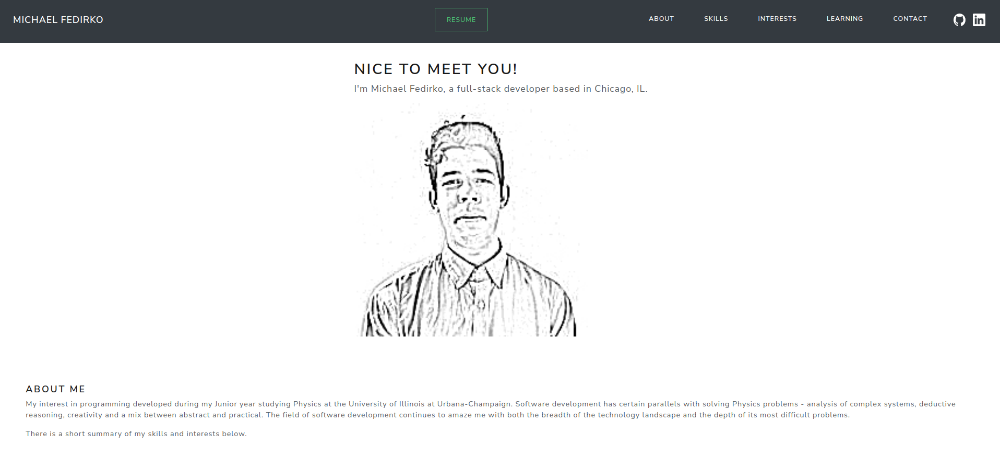

This is a full-stack developer portfolio and the source code for https://michaelfedirko.com.

## Main Features
- About, Skills and Interests on single page with scroll navigation
- Links to Resume, GitHub and LinkedIn
- Contact Me form with validation and reCaptcha
- Learning section contains a list of lessons learned
- Admin page
  - GitHub secured sign-in
  - View history of Contact Me requests 
- Responsive website built using Bootstrap

## Technologies Used
- Java 17
- [Spring Boot 3.x](https://spring.io/projects/spring-boot)
- [Thymeleaf](https://www.thymeleaf.org/) - server-side template engine with good Spring Boot compatibility
- [HTMX](https://htmx.org/) - modern website features without JavaScript
- [Bootstrap](https://getbootstrap.com/) - modern JS and CSS framework
- [Bootswatch](https://bootswatch.com/) - enhanced styles on top of default Bootstrap
- CI/CD using [Github Actions](./.github/workflows)
- Deployed in AWS
  - [Cloudformation](./aws/cloudformation/master.yaml) Infrastructure as Code 
  - [ECS Fargate](./aws/cloudformation/infrastructure/ecs-cluster.yaml) runs the [application service](./aws/cloudformation/services/server-backend/service.yaml)
  - ECR stores Docker image for the application
  - [ALB balances load](./aws/cloudformation/infrastructure/load-balancers.yaml) across ECS tasks
  - [DynamoDB tables](./aws/cloudformation/infrastructure/dynamodb.yaml)
  - [VPC endpoints](./aws/cloudformation/infrastructure/vpc.yaml) allow traffic from private subnet going to S3/DynamoDB/ECR/CloudWatch to stay within AWS

## Local Development
#### Initial Setup
1. Install JDK 17 or higher (if using Intellij, you can [download a JDK within the IDE](https://www.jetbrains.com/guide/java/tips/download-jdk/))
2. Install [Docker and Docker Desktop](https://docs.docker.com/get-docker/)
3. Install [Node.js and NPM](https://docs.npmjs.com/downloading-and-installing-node-js-and-npm)

#### Development
1. Run the main class `src/main/java/io.mfedirko/Application.java`
   1. **VM Options:** `-Dspring.profiles.active=local -Dspring.devtools.restart.enabled=true`
2. Restart and live reload should be triggered by recompiling/rebuilding Java classes and by saving static files 
([docs](https://docs.spring.io/spring-boot/docs/current/reference/html/using.html#using.devtools.livereload))

## Screenshots

## Acknowledgements
Thank you to the following open source projects and authors. 
Their guides and examples were a great help while working on this project. 
- [Sascha Möllering - AWS Samples](https://github.com/aws-samples/reactive-refarch-cloudformation/tree/master)

## Feature Backlog
- Improve mobile compatibility
- Blog posts
- Notes
